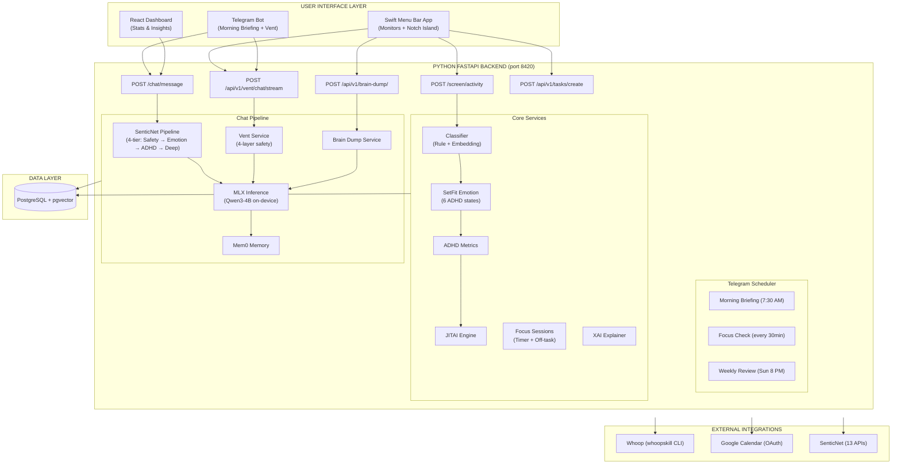

# ADHD Second Brain — Hybrid Architecture Technical Blueprint
## Sentic-Aware Adaptive Productivity System (SAAPS)

[](https://opensource.org/licenses/MIT)
[](https://www.python.org/downloads/)
[](https://swift.org/)
[](https://www.docker.com/)

An always-on macOS ecosystem designed to detect and mitigate ADHD behavioral patterns using **SenticNet Affective Computing** + **Explainable AI (XAI)** + **On-Device LLM Coaching**.

---

## Overview

The **ADHD Second Brain** is a neurosymbolic personal AI assistant that monitors screen activity, processes behavioral + physiological data, and generates real-time, evidence-based ADHD interventions. It bridges the gap between passive monitoring and active support through a "local-first" hybrid architecture.

### What it does:
- **Behavioral Monitoring**: Captures active apps, window titles, and browser URLs every 2-3 seconds via the native Swift menu bar agent.
- **Notch Island Widget**: A 5-state macOS notch widget (Dormant, Glanceable, Expanded, Alert, Ambient) delivering contextual ADHD support directly at the notch.
- **Affective Computing**: Orchestrates SenticNet's 13 APIs across a 4-tier pipeline (Safety, Emotion, ADHD Signals, Personality) to analyze emotional state, intensity, and engagement.
- **Emotion Classification**: SetFit contrastive fine-tuned classifier (86% accuracy) mapping screen activity to 6 ADHD emotional states (joyful, focused, frustrated, anxious, disengaged, overwhelmed).
- **On-Device LLM Coaching**: Qwen3-4B running locally via Apple MLX provides empathetic, ADHD-aware coaching responses informed by SenticNet emotion context.
- **JITAI Engine**: Delivers "Just-in-Time Adaptive Interventions" based on Barkley's 5 Executive Function domains, with Thompson Sampling for frequency adaptation.
- **Focus Sessions**: Task creation, focus timers, and off-task detection using embedding similarity.
- **Brain Dump & Vent**: Quick-capture modals for brain dumps (with AI summarization) and a 4-layer safety vent chat for emotional regulation.
- **Telegram Bot**: Native `python-telegram-bot` integration with scheduled morning briefings, focus checks, and weekly reviews.
- **Physiological Integration**: Connects with **Whoop** data (HRV, Sleep, Recovery) via `whoopskill` CLI for context-aware morning briefings.
- **Google Calendar**: OAuth 2.0 integration for upcoming events displayed in the Notch Island calendar strip.
- **Explainable AI (XAI)**: Provides transparent reasoning for interventions using a Concept Bottleneck architecture.
- **Evaluation Framework**: Ablation testing (SenticNet ON/OFF), LLM persona simulation, emotion classifier benchmarks, and standardized questionnaires (ASRS, SUS) for FYP validation.

---

## System Architecture



---

## Tech Stack

- **Backend**: Python 3.11, FastAPI, SQLAlchemy 2 (async), Alembic, pydantic-settings.
- **Frontend (Native)**: Swift 5.9, SwiftUI, macOS 14+, KeyboardShortcuts, NSWorkspace/AppleScript.
- **Frontend (Web)**: React 18, Recharts, Vite 5.
- **Database**: PostgreSQL 16 with `pgvector` for semantic memory and behavioral patterns.
- **Affective Computing**: SenticNet 7+ (13 REST APIs — emotion, polarity, depression, toxicity, engagement, wellbeing, personality, etc.).
- **Emotion Classification**: SetFit (contrastive fine-tuned `all-mpnet-base-v2`) — 86% accuracy on 6 ADHD emotional states.
- **On-Device LLM**: Apple MLX — Qwen3-4B-4bit (primary, ~2.3GB) / Qwen3-1.7B-4bit (light, ~1.1GB).
- **Memory**: Mem0 for conversational memory with semantic search.
- **Telegram**: `python-telegram-bot` v21 — native bot with scheduled jobs (morning briefing, focus checks, weekly reviews).
- **Integrations**: Whoop via `whoopskill` CLI, Google Calendar (OAuth 2.0).

---

## Directory Structure

```text
.
├── backend/                    # FastAPI Core Engine (port 8420)
│   ├── api/                    # REST endpoints
│   │   ├── chat.py             #   POST /chat/message
│   │   ├── screen.py           #   POST /screen/activity
│   │   ├── evaluation.py       #   POST /eval/ablation, GET /eval/ablation
│   │   ├── insights.py         #   GET /insights/*
│   │   ├── interventions.py    #   GET /interventions/*
│   │   ├── whoop.py            #   GET /whoop/*
│   │   ├── health.py           #   GET /health
│   │   ├── notch.py            #   GET/POST /api/v1/* (Notch Island endpoints)
│   │   ├── brain_dump.py       #   POST /api/v1/brain-dump/*
│   │   ├── vent.py             #   POST /api/v1/vent/*
│   │   └── google_auth.py      #   GET /api/auth/google/*
│   ├── services/               # Business logic
│   │   ├── chat_processor.py   #   Full pipeline: SenticNet → Safety → LLM → Memory
│   │   ├── senticnet_pipeline.py #  4-tier SenticNet orchestration
│   │   ├── senticnet_client.py #   HTTP client for 13 SenticNet APIs
│   │   ├── mlx_inference.py    #   On-device Qwen3 via MLX
│   │   ├── memory_service.py   #   Mem0 conversation memory
│   │   ├── evaluation_logger.py #  Structured JSONL evaluation logging
│   │   ├── activity_classifier.py # Rule-based + embedding classification
│   │   ├── adhd_metrics.py     #   Rolling ADHD metrics engine
│   │   ├── jitai_engine.py     #   Just-in-Time Adaptive Interventions
│   │   ├── xai_explainer.py    #   Concept Bottleneck explainability
│   │   ├── whoop_service.py    #   Whoop data via whoopskill CLI
│   │   ├── constants.py        #   System prompts & crisis resources
│   │   ├── emotion_classifier_setfit.py  # Approach B: Contrastive SetFit (86%, production)
│   │   ├── emotion_classifier_hybrid.py  # Approach A: Embedding + SenticNet (74%)
│   │   ├── emotion_classifier_finetune.py # Approach C: DistilBERT fine-tune (72%)
│   │   ├── setfit_service.py   #   Production emotion classifier singleton
│   │   ├── vent_service.py     #   4-layer safety vent chat
│   │   ├── brain_dump_service.py #  Brain dump capture + AI summary
│   │   ├── brain_dump_reminder.py # Idle-time brain dump reminders
│   │   ├── focus_service.py    #   Task creation, focus sessions, timer
│   │   ├── focus_relevance.py  #   Embedding similarity off-task detection
│   │   ├── snapshot_service.py #   Daily snapshot save/retrieve/backfill
│   │   ├── insights_service.py #   Dashboard aggregations
│   │   ├── google_calendar.py  #   Google Calendar OAuth + event fetching
│   │   ├── action_suggestions.py # Suggested actions from SenticNet result
│   │   └── shared_state.py     #   Module-level service singletons
│   ├── telegram_bot/           # Native Telegram bot integration
│   │   ├── bot.py              #   Application factory + command registration
│   │   ├── formatters.py       #   Message formatting
│   │   ├── scheduler.py        #   Cron: morning briefing, focus check, weekly review
│   │   └── handlers/           #   Command handlers (start, vent, briefing, focus, review)
│   ├── models/                 # Pydantic schemas + trained model artifacts
│   │   ├── chat_message.py     #   ChatInput, ChatResponse, EmotionDetail
│   │   ├── senticnet_result.py #   SenticNetResult (Safety, Emotion, ADHD, Personality)
│   │   ├── vent_models.py      #   Vent session models
│   │   ├── brain_dump_models.py #  Brain dump models
│   │   ├── adhd_state.py       #   ADHD behavioral state
│   │   ├── adhd-emotion-setfit/ #  Trained SetFit model (production)
│   │   ├── adhd-emotion-finetune/ # Trained DistilBERT model
│   │   └── adhd-emotion-hybrid/ # Trained hybrid classifier
│   ├── db/                     # Database models & connection
│   │   ├── database.py         #   Async SQLAlchemy engine
│   │   └── models.py           #   ORM: ActivityLog, SenticAnalysis, FocusTask, DailySnapshot, ...
│   ├── evaluation/             # FYP evaluation suite
│   │   ├── accuracy/           #   Classifier training & accuracy evaluation scripts
│   │   ├── benchmarks/         #   Performance benchmarks (classification, energy, LLM, memory, pipeline, SenticNet)
│   │   ├── data/               #   Training data (498 sentences), test data, Kaggle datasets
│   │   ├── results/            #   Timestamped JSON result files
│   │   ├── persona_runner.py   #   LLM persona simulation (OpenAI/Gemini/Qwen)
│   │   ├── analyze_results.py  #   Ablation comparison + Hourglass-ADHD correlation
│   │   └── questionnaires.py   #   ASRS-v1.1 and SUS scoring utilities
│   ├── prompts/                # LLM prompt templates
│   ├── tests/                  # Pytest test suite
│   └── knowledge/              # ADHD intervention knowledge base
├── swift-app/                  # Native macOS Menu Bar Agent + Notch Island
│   └── ADHDSecondBrain/
│       ├── NotchIsland/        #   5-state notch widget (Dormant → Glanceable → Expanded → Alert → Ambient)
│       ├── Modals/             #   Brain Dump, Vent, Task Creation floating panels
│       ├── Monitors/           #   Screen, Browser, Idle, Transition monitoring
│       ├── UI/                 #   Dashboard, History, Settings, Onboarding views
│       ├── Networking/         #   Backend HTTP client (port 8420)
│       ├── Services/           #   Notch coordinator, hover tracking, keyboard shortcuts
│       ├── Notifications/      #   5-tier notification delivery (TierManager)
│       └── DesignSystem/       #   Tokens, animations, spacing
├── dashboard/                  # React + Vite web dashboard
├── openclaw-skills/            # OpenClaw skill definitions (legacy — Telegram now native)
├── sentic-sdk/                 # SenticNet Python SDK
├── docs/                       # Phase documentation, FYP report (Markdown + LaTeX), architectural plans
├── designs/                    # Product & UI design artifacts
├── scripts/                    # Setup & utility scripts
└── docker-compose.yml          # Infrastructure (PostgreSQL 16 + pgvector)
```

---

## API Endpoints

### Core

| Method | Endpoint | Description |
|--------|----------|-------------|
| `GET` | `/health` | Health check (status, version, uptime) |
| `POST` | `/screen/activity` | Log screen activity, classify emotion, trigger JITAI interventions |
| `POST` | `/chat/message` | Process a chat message through the full SenticNet → LLM pipeline |

### Insights

| Method | Endpoint | Description |
|--------|----------|-------------|
| `GET` | `/insights/dashboard` | Aggregated dashboard data |
| `GET` | `/insights/current` | Current session metrics |
| `GET` | `/insights/daily` | Daily breakdown |
| `GET` | `/insights/weekly` | Weekly trend analysis |

### Focus & Tasks

| Method | Endpoint | Description |
|--------|----------|-------------|
| `POST` | `/api/v1/tasks/create` | Create task + start focus session |
| `GET` | `/api/v1/tasks/current` | Current active task |
| `POST` | `/api/v1/tasks/{id}/complete` | Complete a task |
| `POST` | `/api/v1/focus/toggle` | Toggle focus session |
| `GET` | `/api/v1/focus/session` | Focus session state |
| `GET` | `/api/v1/focus/off-task` | Off-task detection status |

### Brain Dump & Vent

| Method | Endpoint | Description |
|--------|----------|-------------|
| `POST` | `/api/v1/brain-dump/` | Capture brain dump |
| `POST` | `/api/v1/brain-dump/stream` | Capture + stream AI summary (SSE) |
| `GET` | `/api/v1/brain-dump/review/recent` | Recent brain dumps |
| `POST` | `/api/v1/vent/chat/stream` | Vent chat with SSE streaming |
| `POST` | `/api/v1/vent/chat` | Vent chat (non-streaming) |
| `POST` | `/api/v1/vent/session/new` | Clear vent session |

### Notch Island (Swift)

| Method | Endpoint | Description |
|--------|----------|-------------|
| `GET` | `/api/v1/emotion/current` | Current behavioral state |
| `GET` | `/api/v1/interventions/pending` | Pending intervention |
| `POST` | `/api/v1/interventions/{id}/acknowledge` | Acknowledge intervention |
| `GET` | `/api/v1/progress/today` | Daily progress (tasks/focus) |
| `GET` | `/api/v1/dashboard/stats` | Dashboard stats with PASE scores |
| `GET` | `/api/v1/dashboard/weekly` | Weekly report |
| `GET` | `/api/v1/dashboard/history` | Snapshot list for date range |
| `GET` | `/api/v1/dashboard/history/{date}` | Full snapshot for a date |
| `POST` | `/api/v1/dashboard/snapshot` | Manual snapshot trigger |
| `POST` | `/api/v1/capture` | Quick capture (thought/idea) |
| `GET` | `/api/v1/calendar/upcoming` | Google Calendar upcoming events |

### Integrations

| Method | Endpoint | Description |
|--------|----------|-------------|
| `GET` | `/api/auth/whoop` | Whoop auth (whoopskill CLI) |
| `GET` | `/api/auth/whoop/status` | Whoop connection status |
| `GET` | `/whoop/recovery` | Fetch latest recovery data |
| `GET` | `/api/auth/google` | Google OAuth redirect |
| `GET` | `/api/auth/google/callback` | Google OAuth callback |
| `GET` | `/api/auth/google/status` | Google Calendar connection status |

### Evaluation

| Method | Endpoint | Description |
|--------|----------|-------------|
| `POST` | `/eval/ablation` | Toggle SenticNet ablation mode (A/B evaluation) |
| `GET` | `/eval/ablation` | Get current ablation status |
| `POST` | `/eval/logging` | Toggle evaluation interaction logging |

---

## Chat Pipeline

The core chat pipeline processes user messages through:

1. **SenticNet Analysis** (4-tier): Safety → Emotion → ADHD Signals → Personality
2. **Safety Check**: Critical state = compassion + Singapore crisis resources, no LLM
3. **Context Building**: Hourglass dimensions (pleasantness, attention, sensitivity, aptitude) + intensity + engagement + wellbeing
4. **LLM Inference**: Qwen3-4B via MLX with SenticNet-informed system prompt
5. **Memory Storage**: Conversation stored in Mem0 for longitudinal context
6. **Evaluation Logging**: Optional structured JSONL logging for ablation analysis

In **ablation mode**, SenticNet is bypassed and the LLM receives a vanilla ADHD coaching prompt — enabling A/B comparison for FYP evaluation.

### Screen Pipeline

The behavioral monitoring pipeline (every 2-3 seconds):

1. **Screen Capture**: Swift agent sends active app + window title + URL
2. **Activity Classification**: Rule-based + embedding classifier categorizes activity
3. **Emotion Classification**: SetFit model maps activity context to 6 ADHD states → PASE radar profile
4. **ADHD Metrics**: Rolling behavioral metrics (focus score, switching frequency, productive ratio)
5. **JITAI Engine**: Thompson Sampling selects and schedules interventions
6. **Off-Task Detection**: Embedding similarity compares current activity against active focus task

---

## Emotion Classification

Three approaches evaluated for classifying screen activity into 6 ADHD emotional states:

| Approach | Architecture | Accuracy | Status |
|----------|-------------|----------|--------|
| A: Hybrid | Sentence embeddings + SenticNet features → sklearn | 74% | Experimental |
| B: SetFit | Contrastive fine-tuned `all-mpnet-base-v2` → LogisticRegression | **86%** | **Production** |
| C: DistilBERT | Full fine-tune on augmented data | 72% | Experimental |

**Production classifier** (Approach B) uses 210 curated training sentences with CoSENT loss, all-unique-pair mining, and hard negatives. Loaded as a singleton at startup via `setfit_service.py`.

Labels: `joyful` · `focused` · `frustrated` · `anxious` · `disengaged` · `overwhelmed`

Mapping: SetFit label → ADHD behavioral state → PASE radar profile (pleasantness, attention, sensitivity, aptitude)

---

## Evaluation Framework

Built-in evaluation infrastructure for FYP validation:

- **Ablation Testing**: Toggle SenticNet ON/OFF at runtime via `POST /eval/ablation` to compare response quality with and without affective computing.
- **LLM Persona Simulation**: 5 diverse ADHD personas (varying subtype, severity, age, gender, occupation) driven by external LLMs (GPT-4o, Gemini, Qwen) against the coaching system.
- **Hourglass-to-ADHD Correlation**: Empirical analysis of SenticNet emotion dimensions vs ADHD subtypes across persona conversations.
- **Classifier Accuracy**: Training and evaluation scripts for all three emotion classification approaches.
- **Performance Benchmarks**: Classification latency, energy usage, LLM inference speed, memory retrieval, full pipeline throughput, SenticNet API latency.
- **Standardized Questionnaires**: ASRS-v1.1 (ADHD screening) and SUS (usability) scoring utilities.

Run evaluations:
```bash
cd backend
make all-eval           # Run all evaluations
make bench              # Run benchmarks only
make eval               # Run accuracy evaluations only
make summary            # Aggregate results into report
```

Or individually:
```bash
python -m evaluation.persona_runner --all --provider openai
python -m evaluation.analyze_results
```

---

## Getting Started

### 1. Prerequisites
- macOS 14.0+ (Sonoma) with Apple Silicon (M1/M2/M3/M4).
- [Docker Desktop](https://www.docker.com/products/docker-desktop/) installed.
- Python 3.11.
- Xcode 15+ (for building the Swift app).

### 2. Infrastructure Setup
Spin up the database:
```bash
docker-compose up -d
```

### 3. Backend Setup
```bash
cd backend
cp .env.example .env   # Edit with your SenticNet API keys, Telegram bot token, etc.
pip install -r requirements.txt
python main.py          # Starts on port 8420 (includes Telegram bot)
```

### 4. Swift App Setup
1. Open `swift-app/` in Xcode.
2. Build and run.
3. Grant "Screen Recording" and "Accessibility" permissions when prompted.

### 5. Dashboard Setup
```bash
cd dashboard
npm install
npm run dev
```

### 6. Running Tests
```bash
cd backend
python -m pytest tests/ -v
```

---

## Further Documentation

- **Architecture**: [ARCHITECTURE.md](docs/ARCHITECTURE.md)
- **SenticNet Strategy**: [SENTICNET_MAPPING.md](docs/SENTICNET_MAPPING.md)
- **XAI Framework**: [XAI_FRAMEWORK.md](docs/XAI_FRAMEWORK.md)
- **API Contracts**: [API_CONTRACTS.md](docs/API_CONTRACTS.md)
- **Data Models**: [DATA_MODELS.md](docs/DATA_MODELS.md)
- **Testing Strategy**: [TESTING_STRATEGY.md](docs/TESTING_STRATEGY.md)
- **Phase Plans**: [docs/plans/](docs/plans/)

---

## License
This project is part of a Final Year Project (FYP). See the [adhd-second-brain-blueprint.md](adhd-second-brain-blueprint.md) for the full developmental roadmap.
