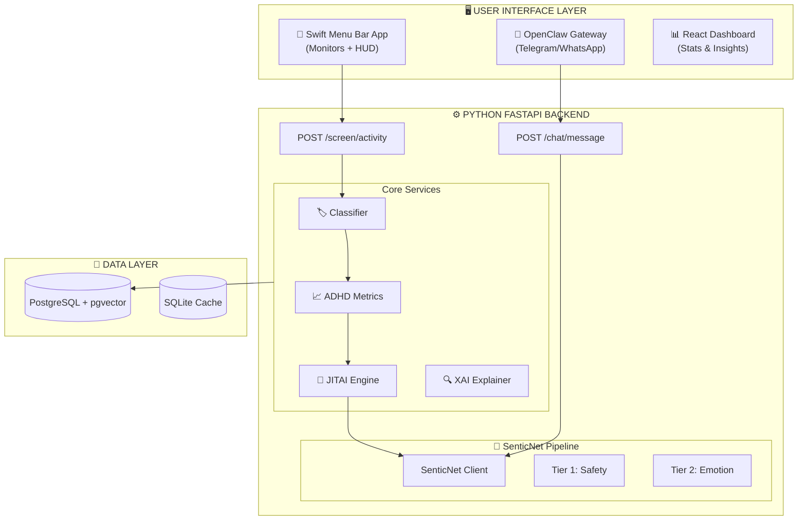

# ADHD Second Brain — Hybrid Architecture Technical Blueprint
## Sentic-Aware Adaptive Productivity System (SAAPS)

[](https://opensource.org/licenses/MIT)
[](https://www.python.org/downloads/)
[](https://swift.org/)
[](https://www.docker.com/)

An always-on macOS ecosystem designed to detect and mitigate ADHD behavioral patterns using **SenticNet Affective Computing** + **Explainable AI (XAI)**.

---

## 🚀 Overview

The **ADHD Second Brain** is a neurosymbolic personal AI assistant that monitors screen activity, processes behavioral + physiological data, and generates real-time, evidence-based ADHD interventions. It bridges the gap between passive monitoring and active support through a "local-first" hybrid architecture.

### What it does:
- **Behaviroal Monitoring**: Captures active apps, window titles, and browser URLs every 2-3 seconds.
- **Affective Computing**: Orchestrates SenticNet's 13 APIs to analyze emotional state, intensity, and engagement.
- **JITAI Engine**: Delivers "Just-in-Time Adaptive Interventions" based on Barkley's 5 Executive Function domains.
- **Physiological Integration**: Connects with **Whoop** data (HRV, Sleep, Recovery) for context-aware morning briefings.
- **Explainable AI (XAI)**: Provides transparent reasoning for interventions using a Concept Bottleneck architecture.
- **Venting/Chat Interface**: Emotional regulation support via **OpenClaw** (Telegram/WhatsApp).

---

## 🏗 System Architecture



---

## 🛠 Tech Stack

- **Backend**: Python 3.10+, FastAPI, SQLAlchemy, Alembic.
- **Frontend (Native)**: Swift 5.9, SwiftUI, NSWorkspace/AppleScript (Mac Automation).
- **Frontend (Web)**: React, Vite, TailwindCSS (Optional Dashboard).
- **Database**: PostgreSQL with `pgvector` for long-term memory.
- **Affective Computing**: SenticNet 7+ REST APIs.
- **Edge AI**: Apple MLX for on-device LLM inference (Llama 3.2).
- **Integrations**: Whoop Cloud API v2, OpenClaw Multi-Agent Framework.

---

## 📦 Directory Structure

```text
.
├── backend/                # FastAPI Core Engine
│   ├── api/                # REST endpoints
│   ├── services/           # Business logic (SenticNet, JITAI, XAI)
│   ├── models/             # Pydantic schemas
│   └── db/                 # Repositories & Migrations
├── swift-app/              # Native macOS Menu Bar Agent
│   ├── ADHDSecondBrain/    # SwiftUI Source
│   └── Monitors/           # Screen/Browser capture logic
├── openclaw-skills/        # Custom skills for OpenClaw (Chat/Venting)
├── docs/                   # Detailed architectural & phase docs
├── docker-compose.yml      # Infrastructure (PostgreSQL + pgvector)
└── scripts/                # Setup & utility scripts
```

---

## 🚦 Getting Started

### 1. Prerequisites
- macOS 13.0+ (Ventura) with Apple Silicon (M1/M2/M3).
- [Docker Desktop](https://www.docker.com/products/docker-desktop/) installed.
- Python 3.11+.
- Xcode 15+ (for building the Swift app).

### 2. Infrastructure Setup
Spin up the database:
```bash
docker-compose up -d
```

### 3. Backend Setup
1. Navigate to `backend/`.
2. Create a `.env` file (see `.env.example`).
3. Install dependencies:
   ```bash
   pip install -r requirements.txt
   ```
4. Run migrations/seed data (if applicable):
   ```bash
   python main.py
   ```

### 4. Swift App Setup
1. Open `swift-app/Package.swift` or the Xcode project.
2. Build and run.
3. **Important**: Grant "Screen Recording" and "Accessibility" permissions when prompted.

---

## 📖 Further Documentation

- **Architecture**: [ARCHITECTURE.md](docs/ARCHITECTURE.md)
- **SenticNet Strategy**: [SENTICNET_MAPPING.md](docs/SENTICNET_MAPPING.md)
- **XAI Framework**: [XAI_FRAMEWORK.md](docs/XAI_FRAMEWORK.md)
- **Phase 1 Backend**: [PHASE_1_PYTHON_BACKEND.md](docs/PHASE_1_PYTHON_BACKEND.md)

---

## 📜 License
This project is part of a Final Year Project (FYP). See the [adhd-second-brain-blueprint.md](adhd-second-brain-blueprint.md) for the full developmental roadmap.
