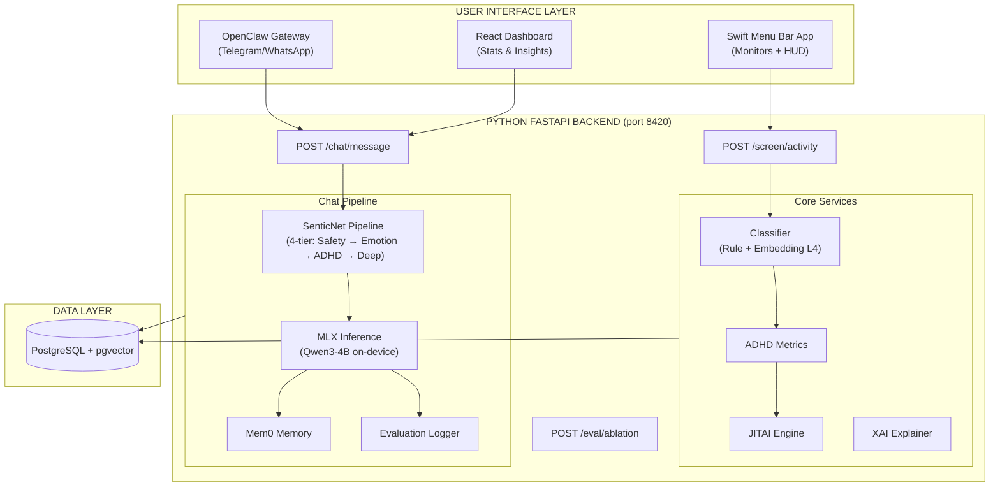

# ADHD Second Brain — Hybrid Architecture Technical Blueprint
## Sentic-Aware Adaptive Productivity System (SAAPS)

[](https://opensource.org/licenses/MIT)
[](https://www.python.org/downloads/)
[](https://swift.org/)
[](https://www.docker.com/)

An always-on macOS ecosystem designed to detect and mitigate ADHD behavioral patterns using **SenticNet Affective Computing** + **Explainable AI (XAI)** + **On-Device LLM Coaching**.

---

## Overview

The **ADHD Second Brain** is a neurosymbolic personal AI assistant that monitors screen activity, processes behavioral + physiological data, and generates real-time, evidence-based ADHD interventions. It bridges the gap between passive monitoring and active support through a "local-first" hybrid architecture.

### What it does:
- **Behavioral Monitoring**: Captures active apps, window titles, and browser URLs every 2-3 seconds via the native Swift menu bar agent.
- **Affective Computing**: Orchestrates SenticNet's 13 APIs across a 4-tier pipeline (Safety, Emotion, ADHD Signals, Personality) to analyze emotional state, intensity, and engagement.
- **On-Device LLM Coaching**: Qwen3-4B running locally via Apple MLX provides empathetic, ADHD-aware coaching responses informed by SenticNet emotion context.
- **JITAI Engine**: Delivers "Just-in-Time Adaptive Interventions" based on Barkley's 5 Executive Function domains, with Thompson Sampling for frequency adaptation.
- **Physiological Integration**: Connects with **Whoop** data (HRV, Sleep, Recovery) for context-aware morning briefings.
- **Explainable AI (XAI)**: Provides transparent reasoning for interventions using a Concept Bottleneck architecture.
- **Chat Interface**: Emotional regulation support via **OpenClaw** (Telegram/WhatsApp) and a web dashboard.
- **Evaluation Framework**: Ablation testing (SenticNet ON/OFF), LLM persona simulation, and standardized questionnaires (ASRS, SUS) for FYP validation.

---

## System Architecture



---

## Tech Stack

- **Backend**: Python 3.10+, FastAPI, SQLAlchemy (async), pydantic-settings.
- **Frontend (Native)**: Swift 5.9, SwiftUI, NSWorkspace/AppleScript (Mac Automation).
- **Frontend (Web)**: React, Vite (Dashboard for stats & insights).
- **Database**: PostgreSQL with `pgvector` for semantic memory and behavioral patterns.
- **Affective Computing**: SenticNet 7+ (13 REST APIs — emotion, polarity, depression, toxicity, engagement, wellbeing, personality, etc.).
- **On-Device LLM**: Apple MLX — Qwen3-4B-4bit (primary, ~2.3GB) / Qwen3-1.7B-4bit (light, ~1.1GB).
- **Memory**: Mem0 for conversational memory with semantic search.
- **Integrations**: Whoop Cloud API v2 (OAuth 2.0), OpenClaw Multi-Agent Framework (Telegram/WhatsApp).

---

## Directory Structure

```text
.
├── backend/                    # FastAPI Core Engine (port 8420)
│   ├── api/                    # REST endpoints
│   │   ├── chat.py             #   POST /chat/message
│   │   ├── screen.py           #   POST /screen/activity
│   │   ├── evaluation.py       #   POST /eval/ablation, GET /eval/ablation
│   │   ├── insights.py         #   GET /insights/*
│   │   ├── interventions.py    #   GET /interventions/*
│   │   ├── whoop.py            #   GET /whoop/*
│   │   └── health.py           #   GET /health
│   ├── services/               # Business logic
│   │   ├── chat_processor.py   #   Full pipeline: SenticNet → Safety → LLM → Memory
│   │   ├── senticnet_pipeline.py #  4-tier SenticNet orchestration
│   │   ├── senticnet_client.py #   HTTP client for 13 SenticNet APIs
│   │   ├── mlx_inference.py    #   On-device Qwen3 via MLX
│   │   ├── memory_service.py   #   Mem0 conversation memory
│   │   ├── evaluation_logger.py #  Structured JSONL evaluation logging
│   │   ├── activity_classifier.py # Rule-based + embedding classification
│   │   ├── adhd_metrics.py     #   Rolling ADHD metrics engine
│   │   ├── jitai_engine.py     #   Just-in-Time Adaptive Interventions
│   │   ├── xai_explainer.py    #   Concept Bottleneck explainability
│   │   ├── whoop_service.py    #   Whoop OAuth & recovery data
│   │   └── constants.py        #   System prompts & crisis resources
│   ├── models/                 # Pydantic schemas
│   │   ├── chat_message.py     #   ChatInput, ChatResponse, EmotionDetail
│   │   └── senticnet_result.py #   SenticNetResult (Safety, Emotion, ADHD, Personality)
│   ├── db/                     # Database models & connection
│   ├── evaluation/             # FYP evaluation scripts (separate from main app)
│   │   ├── personas_config.json #  5 diverse ADHD persona definitions
│   │   ├── persona_runner.py   #   LLM persona simulation (OpenAI/Gemini/Qwen)
│   │   ├── analyze_results.py  #   Ablation comparison + Hourglass-ADHD correlation
│   │   └── questionnaires.py   #   ASRS-v1.1 and SUS scoring utilities
│   ├── tests/                  # Pytest test suite (200+ tests)
│   └── knowledge/              # ADHD intervention knowledge base
├── swift-app/                  # Native macOS Menu Bar Agent
├── dashboard/                  # React + Vite web dashboard
├── openclaw-skills/            # OpenClaw integration skills (Telegram/WhatsApp)
├── sentic-sdk/                 # SenticNet Python SDK
├── docs/                       # Phase documentation & architectural plans
├── scripts/                    # Setup & utility scripts
└── docker-compose.yml          # Infrastructure (PostgreSQL + pgvector)
```

---

## API Endpoints

| Method | Endpoint | Description |
|--------|----------|-------------|
| `POST` | `/chat/message` | Process a chat message through the full SenticNet → LLM pipeline |
| `POST` | `/screen/activity` | Log screen activity & trigger JITAI interventions |
| `GET` | `/health` | Health check (status, version, uptime) |
| `GET` | `/insights/dashboard` | Aggregated dashboard data |
| `GET` | `/insights/current` | Current session metrics |
| `GET` | `/insights/daily` | Daily breakdown |
| `GET` | `/insights/weekly` | Weekly trend analysis |
| `GET` | `/whoop/authorize` | Initiate Whoop OAuth flow |
| `GET` | `/whoop/callback` | OAuth callback |
| `GET` | `/whoop/recovery` | Fetch latest recovery data |
| `POST` | `/eval/ablation` | Toggle SenticNet ablation mode (A/B evaluation) |
| `GET` | `/eval/ablation` | Get current ablation status |
| `POST` | `/eval/logging` | Toggle evaluation interaction logging |

---

## Chat Pipeline

The core chat pipeline processes user messages through:

1. **SenticNet Analysis** (4-tier): Safety → Emotion → ADHD Signals → Personality
2. **Safety Check**: Critical state = compassion + Singapore crisis resources, no LLM
3. **Context Building**: Hourglass dimensions (pleasantness, attention, sensitivity, aptitude) + intensity + engagement + wellbeing
4. **LLM Inference**: Qwen3-4B via MLX with SenticNet-informed system prompt
5. **Memory Storage**: Conversation stored in Mem0 for longitudinal context
6. **Evaluation Logging**: Optional structured JSONL logging for ablation analysis

In **ablation mode**, SenticNet is bypassed and the LLM receives a vanilla ADHD coaching prompt — enabling A/B comparison for FYP evaluation.

---

## Evaluation Framework

Built-in evaluation infrastructure for FYP validation:

- **Ablation Testing**: Toggle SenticNet ON/OFF at runtime via `POST /eval/ablation` to compare response quality with and without affective computing.
- **LLM Persona Simulation**: 5 diverse ADHD personas (varying subtype, severity, age, gender, occupation) driven by external LLMs (GPT-4o, Gemini, Qwen) against the coaching system.
- **Hourglass-to-ADHD Correlation**: Empirical analysis of SenticNet emotion dimensions vs ADHD subtypes across persona conversations.
- **Standardized Questionnaires**: ASRS-v1.1 (ADHD screening) and SUS (usability) scoring utilities.

Run persona simulations:
```bash
cd backend
python -m evaluation.persona_runner --all --provider openai
python -m evaluation.analyze_results
```

---

## Getting Started

### 1. Prerequisites
- macOS 13.0+ (Ventura) with Apple Silicon (M1/M2/M3/M4).
- [Docker Desktop](https://www.docker.com/products/docker-desktop/) installed.
- Python 3.10+.
- Xcode 15+ (for building the Swift app).

### 2. Infrastructure Setup
Spin up the database:
```bash
docker-compose up -d
```

### 3. Backend Setup
```bash
cd backend
cp .env.example .env   # Edit with your SenticNet API keys, Whoop credentials, etc.
pip install -r requirements.txt
python main.py          # Starts on port 8420
```

### 4. Swift App Setup
1. Open `swift-app/` in Xcode.
2. Build and run.
3. Grant "Screen Recording" and "Accessibility" permissions when prompted.

### 5. Dashboard Setup
```bash
cd dashboard
npm install
npm run dev
```

### 6. Running Tests
```bash
cd backend
python -m pytest tests/ -v
```

---

## Further Documentation

- **Architecture**: [ARCHITECTURE.md](docs/ARCHITECTURE.md)
- **SenticNet Strategy**: [SENTICNET_MAPPING.md](docs/SENTICNET_MAPPING.md)
- **XAI Framework**: [XAI_FRAMEWORK.md](docs/XAI_FRAMEWORK.md)
- **API Contracts**: [API_CONTRACTS.md](docs/API_CONTRACTS.md)
- **Data Models**: [DATA_MODELS.md](docs/DATA_MODELS.md)
- **Testing Strategy**: [TESTING_STRATEGY.md](docs/TESTING_STRATEGY.md)
- **Phase Plans**: [docs/plans/](docs/plans/)

---

## License
This project is part of a Final Year Project (FYP). See the [adhd-second-brain-blueprint.md](adhd-second-brain-blueprint.md) for the full developmental roadmap.
