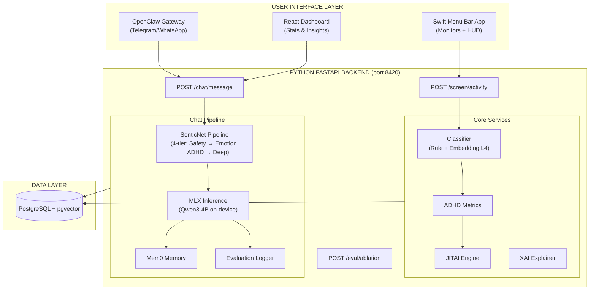

# Welcome to the ADHD Second Brain Wiki!

## Sentic-Aware Adaptive Productivity System (SAAPS)

An always-on macOS ecosystem designed to detect and mitigate ADHD behavioral patterns using **SenticNet Affective Computing** + **Explainable AI (XAI)** + **On-Device LLM Coaching**.

---

## Overview

The **ADHD Second Brain** is a neurosymbolic personal AI assistant that monitors screen activity, processes behavioral + physiological data, and generates real-time, evidence-based ADHD interventions. It bridges the gap between passive monitoring and active support through a "local-first" hybrid architecture.

### What it does:
- **Behavioral Monitoring**: Captures active apps, window titles, and browser URLs every 2-3 seconds via the native Swift menu bar agent.
- **Affective Computing**: Orchestrates SenticNet's 13 APIs across a 4-tier pipeline (Safety, Emotion, ADHD Signals, Personality) to analyze emotional state, intensity, and engagement.
- **On-Device LLM Coaching**: Qwen3-4B running locally via Apple MLX provides empathetic, ADHD-aware coaching responses informed by SenticNet emotion context.
- **JITAI Engine**: Delivers "Just-in-Time Adaptive Interventions" based on Barkley's 5 Executive Function domains, with Thompson Sampling for frequency adaptation.
- **Physiological Integration**: Connects with **Whoop** data (HRV, Sleep, Recovery) for context-aware morning briefings.
- **Explainable AI (XAI)**: Provides transparent reasoning for interventions using a Concept Bottleneck architecture.
- **Chat Interface**: Emotional regulation support via **OpenClaw** (Telegram/WhatsApp) and a web dashboard.
- **Evaluation Framework**: Ablation testing (SenticNet ON/OFF), LLM persona simulation, and standardized questionnaires (ASRS, SUS) for FYP validation.

---

## System Architecture

---

## Tech Stack

- **Backend**: Python 3.10+, FastAPI, SQLAlchemy (async), pydantic-settings.
- **Frontend (Native)**: Swift 5.9, SwiftUI, NSWorkspace/AppleScript (Mac Automation).
- **Frontend (Web)**: React, Vite (Dashboard for stats & insights).
- **Database**: PostgreSQL with `pgvector` for semantic memory and behavioral patterns.
- **Affective Computing**: SenticNet 7+ (13 REST APIs — emotion, polarity, depression, toxicity, engagement, wellbeing, personality, etc.).
- **On-Device LLM**: Apple MLX — Qwen3-4B-4bit (primary, ~2.3GB) / Qwen3-1.7B-4bit (light, ~1.1GB).
- **Memory**: Mem0 for conversational memory with semantic search.
- **Integrations**: Whoop Cloud API v2 (OAuth 2.0), OpenClaw Multi-Agent Framework (Telegram/WhatsApp).

---

## Chat Pipeline

The core chat pipeline processes user messages through:

1. **SenticNet Analysis** (4-tier): Safety → Emotion → ADHD Signals → Personality
2. **Safety Check**: Critical state = compassion + Singapore crisis resources, no LLM
3. **Context Building**: Hourglass dimensions (pleasantness, attention, sensitivity, aptitude) + intensity + engagement + wellbeing
4. **LLM Inference**: Qwen3-4B via MLX with SenticNet-informed system prompt
5. **Memory Storage**: Conversation stored in Mem0 for longitudinal context
6. **Evaluation Logging**: Optional structured JSONL logging for ablation analysis

In **ablation mode**, SenticNet is bypassed and the LLM receives a vanilla ADHD coaching prompt — enabling A/B comparison for FYP evaluation.

---

## Evaluation Framework

Built-in evaluation infrastructure for FYP validation:

- **Ablation Testing**: Toggle SenticNet ON/OFF at runtime via `POST /eval/ablation` to compare response quality with and without affective computing.
- **LLM Persona Simulation**: 5 diverse ADHD personas (varying subtype, severity, age, gender, occupation) driven by external LLMs (GPT-4o, Gemini, Qwen) against the coaching system.
- **Hourglass-to-ADHD Correlation**: Empirical analysis of SenticNet emotion dimensions vs ADHD subtypes across persona conversations.
- **Standardized Questionnaires**: ASRS-v1.1 (ADHD screening) and SUS (usability) scoring utilities.

---

## Navigation & Next Steps

Please use the sidebar to navigate the different architectural facets of this codebase. If you are setting up the project for the first time, refer to the local `README.md` for getting started instructions.
